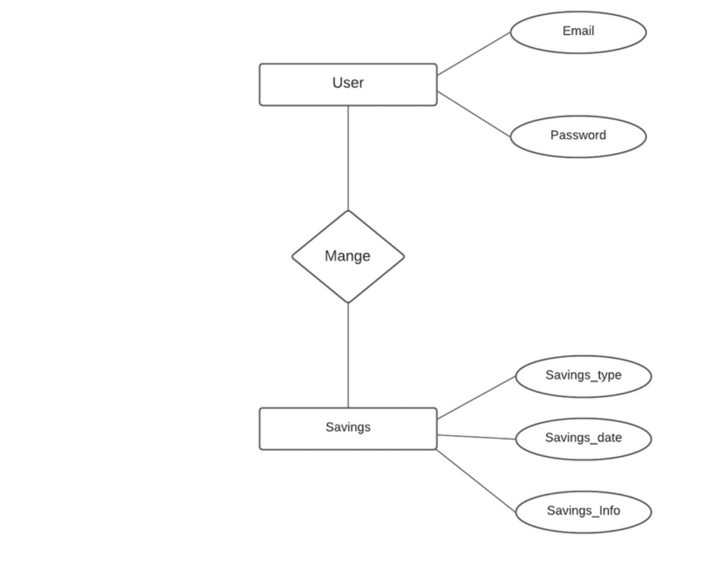

# AppProject# 
SmartWallet Project

SmartWallet is an application designed to help users save, calculate, and manage their savings easily, with features such as currency conversion and expense management for bills like internet, water, electricity, and shopping. This application aims to raise awareness about money-saving practices and smart income management.

## Introduction

In order to ensure a high-quality user experience, SmartWallet was developed to assist users in managing their budget and finances. Our goal is to reach a wide audience, including employees and students who frequently use smartphones, and provide them with economic information in a simple and consistent manner.

## Problem Statement

1. Lack of awareness about money management.
2. Users face difficulties in managing savings and bills.
3. Students have a combination of low income and high expenses, making them a target audience for this app.

## Methodology

The methodology for SmartWallet includes user research and development using various technologies. To understand user needs, we conducted a survey to assess:

- The consumer's interest in budgeting.
- Whether users find it difficult to manage savings and bills.
- Preferences for an application that supports savings and bill management.
- Which demographic is most interested in budget management and whether saving is related to awareness.

## System Design and Implementation

### System Architecture

The following system architecture outlines how the application and various components work together to achieve the objectives of the SmartWallet app.


### Scope

This application aims to provide comprehensive management of expenses, savings, and financial awareness. Below is an overview of the application’s functionality:



### Design

SmartWallet was built using Android Studio with Firebase for backend services and SQLite for local data storage.


### Implementation

The application’s implementation includes several key functionalities like user registration, login, password reset, and account deletion, all integrated with Firebase authentication.

#### Registration Code:
```java
// RegistrationActivity.java
package com.example.expensestracker;
import androidx.annotation.NonNull;
import androidx.appcompat.app.AppCompatActivity;
import android.app.ProgressDialog;
import android.content.Intent;
import android.os.Bundle;
import android.text.TextUtils;
import android.view.View;
import android.widget.Button;
import android.widget.EditText;
import android.widget.TextView;
import android.widget.Toast;
import com.google.firebase.auth.FirebaseAuth;

public class RegistrationActivity extends AppCompatActivity {
    private EditText mEmail;
    private EditText mPass;
    private Button btnReg;
    private TextView mSignin;
    private ProgressDialog mDialog;
    private FirebaseAuth mAuth;

    @Override
    protected void onCreate(Bundle savedInstanceState) {
        super.onCreate(savedInstanceState);
        setContentView(R.layout.activity_registration);
        mAuth = FirebaseAuth.getInstance();
        mDialog = new ProgressDialog(this);
        registration();
    }

    private void registration(){
        mEmail = findViewById(R.id.email_reg);
        mPass = findViewById(R.id.password_reg);
        btnReg = findViewById(R.id.btn_reg);
        mSignin = findViewById(R.id.Signin_here);

        btnReg.setOnClickListener(view -> {
            String email = mEmail.getText().toString().trim();
            String pass = mPass.getText().toString().trim();

            if (TextUtils.isEmpty(email)) {
                mEmail.setError("Email Required..");
                return;
            }
            if (TextUtils.isEmpty(pass)) {
                mPass.setError("Password Required..");
                return;
            }

            mDialog.setMessage("Processing..");
            mDialog.show();

            mAuth.createUserWithEmailAndPassword(email, pass)
                .addOnCompleteListener(task -> {
                    mDialog.dismiss();
                    if (task.isSuccessful()) {
                        Toast.makeText(getApplicationContext(), "Registration Complete", Toast.LENGTH_SHORT).show();
                        startActivity(new Intent(getApplicationContext(), MainActivity.class));
                    } else {
                        Toast.makeText(getApplicationContext(), "Registration Failed", Toast.LENGTH_SHORT).show();
                    }
                });
        });

        mSignin.setOnClickListener(view -> startActivity(new Intent(getApplicationContext(), MainActivity2.class)));
    }
}
